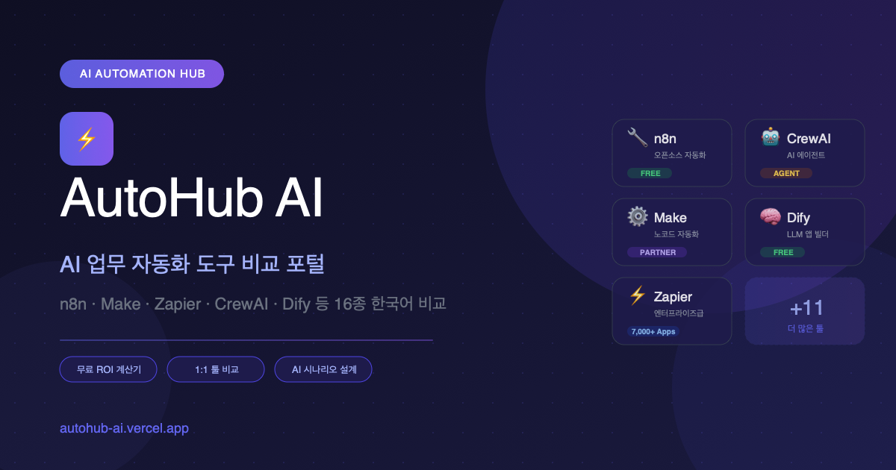

# AutoHub AI

한국어 업무 자동화 툴을 **비교하고, 바로 시작할 수 있게** 만드는 정적 웹 포털.

[](https://autohub-ai.vercel.app)
[](https://react.dev)
[](https://vitejs.dev)
[](https://www.typescriptlang.org)
[](#)

**Demo:** https://autohub-ai.vercel.app

<p align="center">
  
</p>

---

## Why this project

업무 자동화 툴(n8n, Make, Zapier 등)은 많지만, 한국어로 **기능·가격·난이도를 한눈에 비교**하고 공식 사이트로 바로 이어지는 진입점은 부족했다.

AutoHub AI는 그 갭을 메우기 위해 만들었다.  
서버·DB·AI API 없이 **정적 SPA + 제휴 링크**만으로 운영 가능한 제품 형태를 택했다.

| 결정 | 이유 |
|------|------|
| 완전 정적 (Vite → Vercel CDN) | 운영 비용·장애 면 최소화 |
| 비교 + 제휴만 유지 | 수익 모델과 유지보수 범위 정렬 |
| 상담/리드/AI 챗 제거 | 범위 밖 기능은 의도적으로 제외 |

---

## Features

- **툴 디렉토리** — 16종 자동화 플랫폼 검색·필터·상세 모달
- **1:1 비교** — 레이더 차트·가격·난이도 나란히 비교 (`/?tab=compare`)
- **제휴 CTA** — Make / Dify 등 배너·모달·비교 화면에서 동일 링크 소스
- **SEO** — sitemap, robots, OG, JSON-LD, 툴별 동적 메타 (`?tool=`)
- **정적 블로그** — `public/blog` 가이드 콘텐츠
- **쿠키 동의 후 GA4** — 동의 전까지 분석 스크립트 미로드

---

## Tech stack

| Layer | Choice |
|-------|--------|
| UI | React 19, TypeScript, Tailwind CSS 4 |
| Build | Vite 6 |
| Charts | Recharts (비교 레이더) |
| Hosting | Vercel (static) |
| Analytics | GA4 (consent-gated) |

**의도적으로 쓰지 않은 것:** Express, Groq, Supabase, 리드 폼, 서버리스 API.

---

## Architecture (simple)

```text
Browser
  └─ Vite SPA (React)
       ├─ tools.ts          툴 데이터
       ├─ affiliateLinks.ts 제휴 URL 단일 소스
       ├─ useSeoMeta        title / canonical / OG
       └─ CookieConsent     GA4 로드 게이트

CDN
  ├─ index.html + assets
  ├─ public/sitemap.xml
  ├─ public/robots.txt
  └─ public/blog/*.html
```

설계 배경: [docs/architecture.md](docs/architecture.md)

---

## Quick start

```bash
npm install
npm run dev      # http://localhost:5173
npm run lint     # tsc --noEmit
npm run test     # smoke checks
npm run build
```

런타임 API 키·`.env` 불필요.

---

## Project structure

```text
src/
├── components/   UI (디렉토리, 비교, 제휴, FAQ, 동의)
├── config/       affiliateLinks.ts
├── data/         tools.ts
├── hooks/        useSeoMeta.ts
└── lib/          analytics.ts
public/
├── blog/         정적 가이드
├── sitemap.xml
├── robots.txt
└── og-image.png
scripts/
└── smoke-test.mjs
```

---

## Highlights for reviewers

1. **범위 축소 판단** — AI/리드/계산기를 빼고 비교·제휴에 집중
2. **단일 제휴 소스** — `AFFILIATE_LINKS`로 CTA 경로 일관 유지
3. **SEO 딥링크** — `?tool=` / `?tab=compare` + sitemap slug 검증 테스트
4. **프라이버시** — 쿠키 동의 후에만 GA4 로드

---

## Links

- Live: https://autohub-ai.vercel.app
- Compare: https://autohub-ai.vercel.app/?tab=compare
- Example tool: https://autohub-ai.vercel.app/?tool=make
