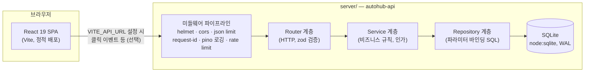

# AutoHub AI

한국어 업무 자동화 툴을 **비교하고, 바로 시작할 수 있게** 만드는 웹 포털 — 그리고 이를 지탱하는 **백엔드 API를 처음부터 직접 구축한 풀스택 학습 프로젝트**.

[](https://autohub-ai.vercel.app)
[](https://react.dev)
[](https://www.typescriptlang.org)
[](https://expressjs.com)
[](https://nodejs.org/api/sqlite.html)

<p align="center">
  
</p>

- **프론트 프로덕션:** https://autohub-ai.vercel.app — 정적 SPA, **API 없이도 100% 동작**
- **백엔드:** `server/` — Express 5 + TypeScript(strict) + SQLite. 인증/리뷰/북마크/클릭 통계 REST API

---

## Why this project

업무 자동화 툴(n8n, Make, Zapier 등)을 한국어로 **기능·가격·난이도 비교**하고 공식 사이트로 바로 이어주는 제휴 사이트로 시작했다. 여기에 백엔드 개발 역량 학습을 위해 **운영 수준의 관례를 갖춘 REST API**(계층 아키텍처, JWT 인증, 마이그레이션, 테스트, Docker, CI)를 직접 설계·구현해 얹었다.

| 결정 | 이유 |
|------|------|
| 프론트는 완전 정적 유지 (Vite → Vercel CDN) | 운영 비용·장애 면 최소화, 제휴 수익 모델 유지 |
| 백엔드는 독립 패키지 (`server/`) | 프론트 배포와 분리된 학습·실험 공간, 의존성 경계 |
| 프론트 ↔ API 연동은 선택 (`VITE_API_URL`) | API가 죽어도 사이트는 동작 — graceful degradation |

---

## 아키텍처



- 요청은 `미들웨어 → 라우터(검증) → 서비스(규칙) → 리포지토리(SQL)` 계층을 지나며, 모든 에러는 중앙 에러 핸들러에서 `{ error: { code, message, requestId } }` 포맷으로 수렴한다.
- 프론트 설계 배경: [docs/architecture.md](docs/architecture.md) · 백엔드 설계: [docs/backend/architecture.md](docs/backend/architecture.md)

## 백엔드 주요 기능

| 영역 | 내용 |
|------|------|
| 인증 | 회원가입/로그인, scrypt 해싱, JWT access(15분) + **refresh 회전·재사용 탐지** |
| 인가 | `user`/`admin` 역할, 리소스 소유권 검사 (내 리뷰만 수정) |
| 툴 카탈로그 | 목록(페이지네이션·카테고리·난이도·검색·정렬), 상세, 관리자 CRUD |
| 리뷰 | 툴당 1인 1리뷰, 평점 집계(`reviewStats`) |
| 북마크 | 멱등 PUT/DELETE |
| 제휴 클릭 | `sendBeacon` 호환 이벤트 수집 → 관리자용 일자별/툴별 통계 |
| 운영 | 구조화 로깅(pino)+요청 ID, 레이트 리밋(직접 구현), 헬스/레디니스, graceful shutdown |
| 문서 | OpenAPI 3.1 + Swagger UI (`/api/docs`) |

## 시작하기

```bash
# 프론트 (정적 사이트)
npm install
npm run dev              # http://localhost:5173

# 백엔드 API
cd server && npm install
cp .env.example .env     # 필요 시 값 수정
npm run dev              # http://localhost:4000 (Swagger: /api/docs)

# 프론트 ↔ 백엔드 연동 개발 (선택)
# 루트에 .env 생성 후 VITE_API_URL=http://localhost:4000 설정

# Docker로 백엔드 실행
echo "JWT_SECRET=$(openssl rand -base64 48)" > .env
docker compose up --build api
```

관리자 계정이 필요하면 서버 환경변수 `ADMIN_EMAIL` / `ADMIN_PASSWORD`를 설정하고 부팅한다.

## 검증

```bash
npm run verify   # 프론트+백엔드 lint/test/build 전체
```

| 대상 | lint | test | build |
|------|------|------|-------|
| 프론트 | `npm run lint` | `npm run test` (스모크) | `npm run build` |
| 백엔드 | `npm run lint:api` | `npm run test:api` (vitest+supertest 75개) | `npm run build:api` |

CI: `.github/workflows/ci.yml` — push/PR마다 양쪽 lint·test·build + Docker 이미지 빌드.

## API 한눈에 보기

전체 스펙은 서버 기동 후 `/api/docs` (Swagger UI) 또는 [server/src/openapi/openapi.ts](server/src/openapi/openapi.ts).

```text
POST   /api/v1/auth/register|login|refresh|logout      GET /api/v1/auth/me
GET    /api/v1/tools            (page·limit·category·difficulty·q·sort·order)
POST   /api/v1/tools                                   (admin)
GET|PATCH|DELETE /api/v1/tools/:slug                   (쓰기: admin)
GET|POST /api/v1/tools/:slug/reviews                   (쓰기: 로그인)
PATCH|DELETE /api/v1/reviews/:id                       (본인 / 삭제는 admin 가능)
GET    /api/v1/me/bookmarks     PUT|DELETE /api/v1/me/bookmarks/:slug
POST   /api/v1/tools/:slug/clicks                      (공개, 본문 불필요)
GET    /api/v1/stats/clicks     (admin, groupBy=tool|day)
GET    /health · /health/ready · /api/docs
```

## 기술 스택

| 레이어 | 기술 | 선택 이유 (요약) |
|--------|------|------------------|
| 프론트 | React 19 + TypeScript + Vite | 기존 유지, strict 모드 활성화 |
| API | Express 5 + TypeScript strict | v5의 async 에러 자동 전파, 업계 표준 |
| DB | SQLite (`node:sqlite`) | Node 내장 — 의존성 0, 마이그레이션/SQL 직접 학습 |
| 검증 | zod v4 | 경계(env/요청) 검증 + 타입 추론 |
| 인증 | jsonwebtoken + `node:crypto` scrypt | KDF/토큰 원리를 직접 다루기 위함 |
| 로깅 | pino / pino-http | 구조화 JSON 로그 |
| 테스트 | vitest + supertest | in-memory SQLite로 HTTP 전 구간 통합 테스트 |
| 배포 | Vercel(정적) + Docker(API) | 멀티 스테이지 빌드, non-root 실행 |

## 프로젝트 구조

```text
├── src/                  # 프론트 (React SPA)
│   ├── components/       #   디렉토리·비교·제휴·FAQ UI
│   ├── data/tools.ts     #   툴 데이터 (단일 진실 공급원)
│   └── lib/apiClient.ts  #   선택적 API 클라이언트 (VITE_API_URL)
├── server/               # 백엔드 (독립 npm 패키지)
│   ├── src/
│   │   ├── config/env.ts         # zod 환경변수 검증 (fail-fast)
│   │   ├── db/                   # 커넥션·마이그레이션 러너·시드
│   │   ├── lib/                  # errors·password(scrypt)·jwt·pagination
│   │   ├── middleware/           # request-id·logger·rate-limit·auth·error-handler
│   │   ├── modules/              # auth·tools·reviews·bookmarks·clicks·health
│   │   │   └── */ *.router.ts → *.service.ts → *.repository.ts
│   │   └── openapi/              # OpenAPI 3.1 + Swagger UI
│   ├── tests/            # vitest + supertest (in-memory DB)
│   ├── scripts/sync-tools.ts     # 프론트 데이터 → 서버 시드 동기화
│   └── Dockerfile
├── docs/                 # architecture(프론트)·backend(아키텍처·학습 로드맵)
└── .github/workflows/ci.yml
```

## 문서

- 프론트 설계 배경: [docs/architecture.md](docs/architecture.md)
- 백엔드 아키텍처·설계 결정: [docs/backend/architecture.md](docs/backend/architecture.md)
- 백엔드 학습 로드맵(역량 ↔ 코드 매핑): [docs/backend/learning-roadmap.md](docs/backend/learning-roadmap.md)
- 서버 상세 사용법: [server/README.md](server/README.md)

## Links

- Live: https://autohub-ai.vercel.app
- Compare: https://autohub-ai.vercel.app/?tab=compare
- Example tool: https://autohub-ai.vercel.app/?tool=make
