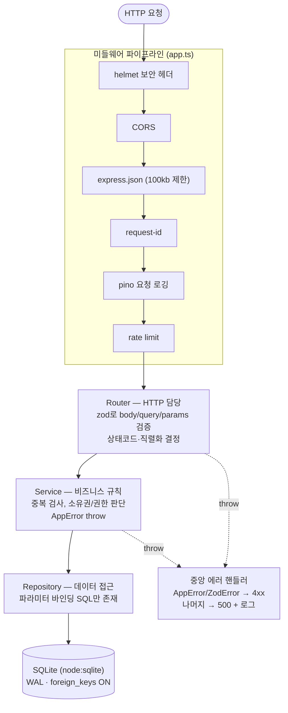
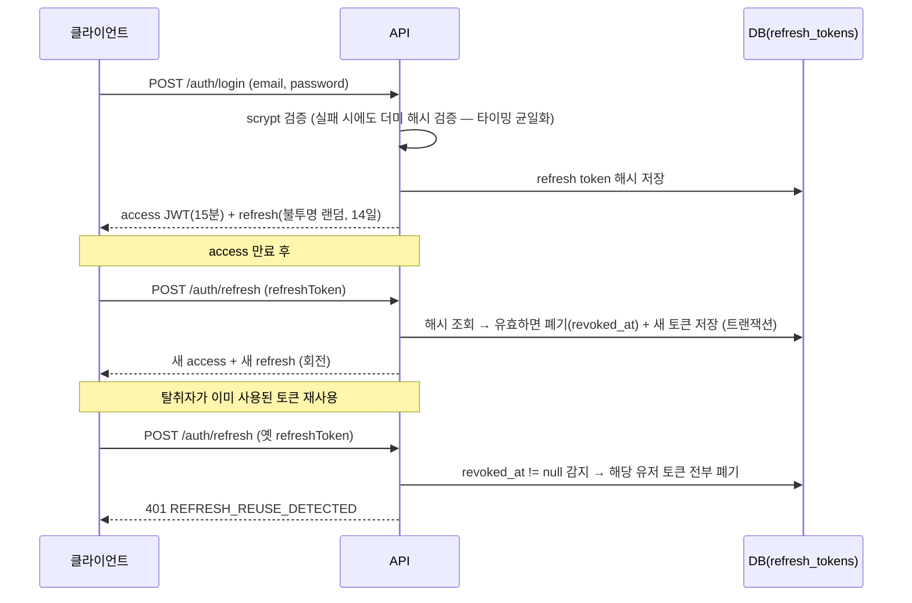
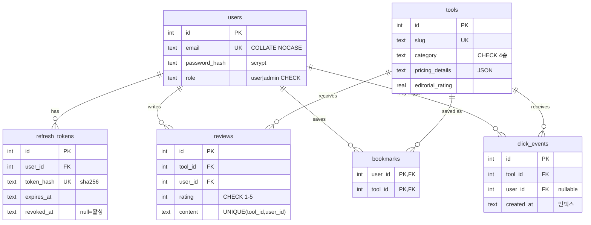

# 백엔드 아키텍처

`server/` (autohub-api)의 구조, 요청 생명주기, 그리고 **왜 이렇게 설계했는지**를 기록한다.
설계 결정의 이유를 설명할 수 있는 것이 코드 작성만큼 중요하다 (면접에서 가장 많이 묻는 부분).

## 1. 계층형 아키텍처

**계층별 책임 규칙**

| 계층 | 아는 것 | 몰라야 하는 것 |
|------|---------|----------------|
| Router | HTTP(요청/응답/상태코드), zod 스키마 | SQL, 비즈니스 규칙 |
| Service | 도메인 규칙, 권한/소유권, 트랜잭션 경계 | HTTP, SQL 문법 |
| Repository | SQL, 테이블 구조 | HTTP, 도메인 규칙 |

이 분리 덕에: 서비스는 HTTP 없이 단위 테스트 가능하고, DB를 PostgreSQL로 바꿀 때 Repository만 교체하면 되며, 응답 포맷 변경은 Router만 만지면 된다.

**의존성 주입(DI)**: 프레임워크 없이 생성자 주입만 사용한다. `app.ts`의 `buildApp()`이 유일한 조립 지점(composition root)이라, 테스트에서 in-memory DB를 꽂아 전체 앱을 그대로 띄운다 (`tests/helpers/test-app.ts`).

## 2. 인증 설계

### 토큰 전략: 짧은 JWT + 회전되는 refresh token

**결정과 이유**

- access token은 **stateless JWT**: 요청마다 DB를 안 거쳐 빠르고 수평 확장이 쉽다. 대신 강제 만료가 안 되므로 수명을 15분으로 짧게 둔다.
- refresh token은 **JWT가 아닌 불투명 랜덤 문자열 + DB 저장**: 서버가 즉시 폐기(로그아웃, 세션 종료)할 수 있어야 하기 때문. DB에는 sha256 해시만 저장 — DB가 유출돼도 토큰 원문 재사용 불가.
- **회전(rotation) + 재사용 탐지**: 한 번 쓴 refresh token은 죽는다. 죽은 토큰이 다시 오면 토큰 탈취 정황으로 보고 그 사용자의 모든 세션을 종료한다 (OWASP 권장 패턴).
- 비밀번호는 `node:crypto`의 **scrypt** (메모리-하드 KDF). salt 무작위 + `timingSafeEqual` 비교 + 파라미터를 해시 문자열에 저장해 향후 강도 상향 가능 (`lib/password.ts`).
- 로그인 실패 시 "이메일 없음/비밀번호 틀림"을 구분하지 않는다 → 계정 존재 여부(user enumeration) 미노출. 존재하지 않는 계정도 더미 해시 검증을 수행해 응답 시간 차이를 줄인다.

### 인가(Authorization)

- 역할 기반(RBAC): `user` / `admin` — 401(누구세요?)과 403(권한 없음)을 구분한다.
- 리소스 소유권: 리뷰 수정은 작성자만, 삭제는 작성자+관리자(모더레이션). 서비스 계층에서 검사한다.

## 3. 데이터 모델

**결정과 이유**

- **무결성은 DB에서 강제**: CHECK(평점 1–5, 역할 enum), UNIQUE(1인 1리뷰), FK CASCADE(툴 삭제 시 리뷰·북마크 정리). 애플리케이션 검증은 우회될 수 있어도 DB 제약은 최후의 방어선이다. SQLite는 `PRAGMA foreign_keys=ON`을 켜야 FK가 동작한다는 함정도 코드에 명시했다.
- `features`/`pros` 등은 **JSON TEXT 컬럼**: 항상 통째로 읽고 쓰는 데이터라 정규화 이득이 없다. 반대로 리뷰는 필터/집계가 필요하므로 별도 테이블. "언제 정규화하고 언제 안 하는가"의 판단 기준을 보여주는 예시.
- `click_events`는 **append-only 이벤트 로그**: 수익 원천 데이터는 수정하지 않고 쌓는다. 집계는 조회 시 GROUP BY (범위 인덱스 `(tool_id, created_at)`).
- 시간은 **UTC ISO-8601 TEXT**: SQLite에 날짜 타입이 없고, ISO 문자열은 사전순 = 시간순이라 범위 쿼리가 그대로 동작한다.

### 마이그레이션

`db/migrate.ts` — 직접 구현한 러너. `schema_migrations` 테이블로 적용 이력을 추적하고, 각 마이그레이션은 트랜잭션 안에서 실행된다(실패 시 통째로 롤백). 규칙: **적용된 마이그레이션은 수정 금지, 항상 새 파일 추가**. Prisma/Flyway가 해주는 일의 최소 골격이다.

### 시드

프론트의 `src/data/tools.ts`가 단일 진실 공급원. `server/scripts/sync-tools.ts`가 이를 `tools.seed.ts`로 변환하고, 부팅 시 `INSERT OR IGNORE`로 주입한다(관리자가 API로 수정한 데이터를 시드가 덮어쓰지 않도록).

## 4. 횡단 관심사 (미들웨어)

| 미들웨어 | 역할 | 핵심 결정 |
|----------|------|-----------|
| `request-id` | 모든 요청에 UUID 부여, 응답 헤더 반환 | 게이트웨이가 준 X-Request-Id는 패턴 검증 후 재사용 (로그 인젝션 방지) |
| `request-logger` | pino 구조화 JSON 로그 | 헬스체크는 로그 제외, 4xx=warn/5xx=error 레벨 |
| `rate-limit` | 고정 윈도우, IP별 | 직접 구현(알고리즘 학습). auth 라우트는 별도의 엄격한 한도. 한계: 인메모리라 다중 인스턴스에선 Redis 필요 |
| `auth` | Bearer 검증 → `req.user` | `requireAuth`(401) / `requireAdmin`(403) / `optionalAuth` 분리 |
| `error-handler` | 모든 에러의 종착지 | 포맷 통일 `{error:{code,message,details?,requestId}}`. 내부 스택/메시지는 절대 미노출. Express 5라 async reject도 자동 도달 |

기타 보안 기본기: helmet(보안 헤더), CORS 화이트리스트, `express.json({limit:"100kb"})`(페이로드 DoS), `x-powered-by` 제거, ORDER BY 화이트리스트(인젝션), LIKE 이스케이프, 모든 SQL 파라미터 바인딩.

## 5. API 계약

- 성공: `{ data, meta? }` / 실패: `{ error: { code, message, details?, requestId } }` — 클라이언트는 HTTP status + `code`로 분기한다.
- 목록은 offset 페이지네이션(`page`/`limit`≤100 강제) + `meta.totalItems`. 대규모라면 커서 방식으로 전환 (로드맵 참고).
- 멱등성: 북마크 PUT/DELETE, 로그아웃은 반복 호출해도 같은 결과 → 네트워크 재시도에 안전.
- 클릭 수집은 202 Accepted — "접수"와 "처리 완료"의 의미 구분.
- OpenAPI 3.1을 손으로 관리 (`openapi/openapi.ts`), Swagger UI는 `/api/docs`.

## 6. 운영

- **부팅 순서** (`index.ts`): env 검증(zod, fail-fast) → DB open → migrate → seed → listen.
- **Graceful shutdown**: SIGINT/SIGTERM 시 신규 연결 차단 → 진행 중 요청 완료 → DB close → 종료 (10초 타임아웃 강제 종료).
- **헬스체크**: `/health`(liveness) vs `/health/ready`(readiness, DB 확인) 구분 — "프로세스는 살았는데 DB가 죽은" 상태 감지.
- **Docker**: 멀티 스테이지(빌드 도구 미포함), non-root 유저, HEALTHCHECK 선언, SQLite는 named volume.
- **CI**: 프론트/백엔드 lint·test·build + Docker 빌드 검증.

## 7. 의도적 트레이드오프 (알고 선택한 것)

| 선택 | 대안 | 왜 이걸 골랐나 / 언제 바꿔야 하나 |
|------|------|-----------------------------------|
| SQLite (node:sqlite) | PostgreSQL + ORM | 의존성 0으로 SQL·마이그레이션 원리를 직접 학습. 동시 쓰기 많아지면 Postgres 전환 (Repository만 교체) |
| 수제 rate limiter | express-rate-limit + Redis | 알고리즘 이해 목적. 다중 인스턴스 배포 시 Redis 필수 |
| 토큰을 응답 body로 전달 | HttpOnly 쿠키 | SPA 학습 단순화. XSS에 더 강한 쿠키+CSRF 방어 조합은 로드맵의 연습과제 |
| offset 페이지네이션 | cursor 기반 | 데이터 규모가 작음. 수만 행 이상이면 커서로 |
| OpenAPI 수동 관리 | 코드 자동 생성 | 스펙 문법 학습 목적. 규모가 커지면 zod → OpenAPI 생성 도구 검토 |
